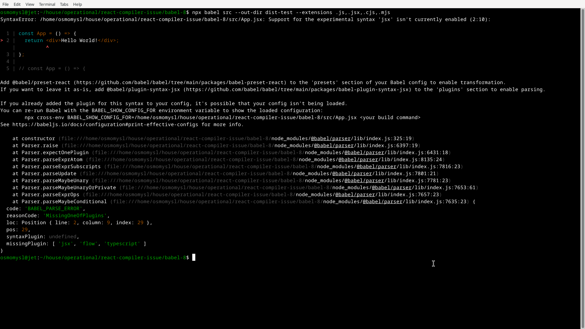

# Usage

In [`./babel-7`](./babel-7/) or [`./babel-8`](./babel-8/), run:

```bash
npx babel src --out-dir dist-test --extensions .js,.jsx,.cjs,.mjs
```

Result (on both versions of `babel`):



While with the `@babel/plugin-transform-arrow-functions` plugin [here](./control/) it does transform the code properly.
